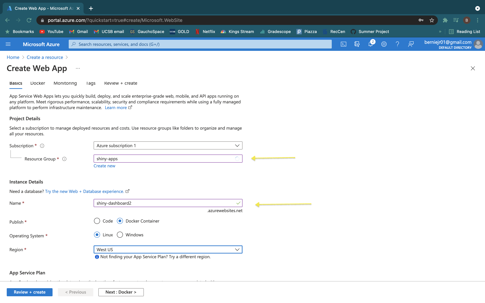

# Movie Sales with a R Shiny Dashboard

<p align="center">
  <a href="https://github.com/othneildrew/Best-README-Template">
    
  </a>
</p>

<details open="open">
  <summary>Table of Contents</summary>
  <ol>
    <li><a href="#about">About</a></li>
    <li><a href="#prerequisites">Prerequisites</a></li>
    <li><a href="#quickstart">Quickstart</a></li>
    <li><a href="#details">Details</a></li>
  </ol>
</details>

## About
In this project we created a dahsboard in R using Shiny that allows us to look at movie sales over time.
We then dockerized our R file to the data accessible to anyone through a container.
We also created actions that automatically pushs and builds an image for any changes made to the R code into our current container.
Using Microsoft Azure, we were able to deploy our dashboard to the cloud maing it accessible on the internet.

## Prerequisites
In order run and modify our app you need to following tools:
- [R (version 4.0.5 and later)](https://mirror.las.iastate.edu/CRAN/)
- [Docker desktop version](https://docs.docker.com/get-docker/)
- [Github desktop version](https://desktop.github.com/)
- [An account on GitHub](https://github.com/)

## Quickstart
In order to only run the project locally you will only need Docker Desktop:
1. The first step is to open docker desktop and get it running
2. next go to any powershell (for example CMD or PowerShell) and type the following.
   ```
   docker pull berniegraves/shiny-dashboard:main
   ```
   This will pull the image into your computer.
3. next type the following to run the image:
   ```
   docker run -dp 3838:3838 berniegraves/shiny-dashboard:main
   ```
4. And done!
   You can now see the shiny dashboard on any browser by going to the following URL:
   ```
   127.0.0.1:3838
   ```

## Details
### Project contents
- In this project we did some basic data analysis using R and displayed it in the form of a dashboard using the Shiny package.
  - In order to learn more about Shiny as a package and how to use it, [this tutorial](https://rstudio.github.io/shinydashboard/get_started.html) will help do just that.
  - The reason we chose Shiny as our tool to display the data was because it is relatively easy to learn and requires very little to no experience in web development lanaguages such as HTML. In addition, Shiny allowed us to do a little more that simply display the graphs by adding sliders and user controlled buttons to make the visualization more interactive.
- In order to make the project public to anyone without having them download R and install the packages or the dataset, we utilized Docker and created a docker image of our dashboard.
  - Docker allows users to exchange codes and packages without the need to install each of the packages and applications on each computer. by placing the project in a docker container, anyone with Docker Desktop can run our dashboard (using the steps under "Quickstart").
- Finally, we created 2 Github actions.
  - The first action that we created built a new Docker image whenever a pull request was made (basically automatically update the current live code), This made it so if anyone made any change in the code, the docker file will automatically update the code that it holds.
  - The second action basically runs a basic test to make sure that after a change in the code was made, it didnt break anything in the dashboard.
  - Together these two GitHub actions saved us a lot of the intermidiate steps that we would have had to do everytime any change was made. 
 
	---


## Deployment with Microsoft Azure
We deployed our dashboard to the cloud using Microsoft Azure's app service.
These are the steps you need to follow to deploy the dashboard using Azure:
1. Login in to or create an account with Microsoft Azure. 
2. Select "Create a resource" and create a "Web App" 
 
 
3. Select or create a resource group which acts as a folder for this resource and give the resource a name, this will act as the url.

4. Select "Docker Container" and the region you want the server to based in.

5. Select the App Service Plan and specs you need for the dashboard


6. Click "Next", then you will need to select the container registry you are using, in this case Docker Hub. Then you need to fill in the name of the image being deployed.

7. Click "Review and Create"
8. Navigate to the resource overview then select "Configuration" on the sidebar.

9. Click on "New Application Setting" and type "WEBSITE_PORT" name and "3838" for value.


Congrats!! Your web app has been deployed

### Creating GitHub workflow
In order to make CI/CD easier, we made a GitHub Actions workflow to automate deployment on pushed to the main branch. Luckily, Azure makes this easy. Before beginning, if you cloned this repository you need to navigate to the workflows folder and delete `main_shiny-dashboard.yml`.
1. Navigate to the resource overview page a select "Deployment Center"

2. Select "Authorize" to allow Azure to connect to your GitHub account.
3. You might need to refresh after authorizing, but it should look like this. Now you need to fill in the necessary information about the GitHub repository, Your Docker Hub sign in information and image name.

4. Click "save" at the top. This will create a workflow file in the Github repository.

Now the dashboard will update when changes are pushed to the repository. 
